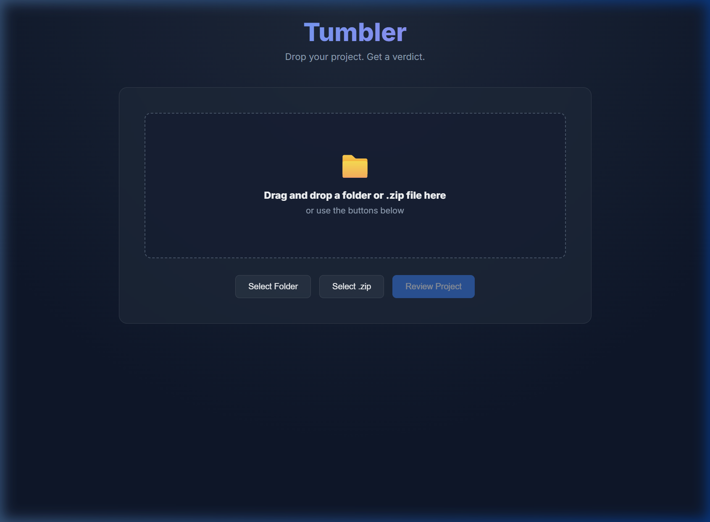

# Tumbler

Tumbler is a local web app that takes a folder of your code and returns exactly one of two verdicts: PASS (done, no blind spots, ship it) or FIX (here is what is wrong, and here is the exact prompt to paste into Antigravity to fix it). It acts as an idea incubator, letting you drop a half-formed project into it to ensure it is developing correctly without getting bogged down by state in your chat sessions.

## Setup

Tumbler requires Python 3.11+.

1. **Create and activate a virtual environment:**
   - **Windows PowerShell:**
     ```powershell
     python -m venv .venv
     .\.venv\Scripts\Activate.ps1
     ```
   - **macOS/Linux:**
     ```bash
     python3 -m venv .venv
     source .venv/bin/activate
     ```

2. **Install dependencies:**
   ```bash
   pip install -r backend/requirements.txt
   ```

3. **GCP Project Setup (for Vertex AI Gemini):**
   - Authenticate with your Google Cloud account:
     ```bash
     gcloud auth application-default login
     ```
   - Copy `.env.example` to `.env` and set your GCP Project ID:
     ```bash
     cp .env.example .env
     ```
     Open `.env` and ensure `GOOGLE_CLOUD_PROJECT=your-project-id` is set.

## Running Locally

From the repository root, start the backend server:

```bash
uvicorn backend.main:app --reload
```

The app is now running. Open your browser and navigate to `http://127.0.0.1:8000`.

## The Workflow

The core Tumbler loop takes three steps. First, you drag your project folder into the web UI and receive a verdict. Second, if you get a FIX verdict, you click the copy button to grab the provided Antigravity Prompt, paste it into Antigravity, and let it implement the fixes. Finally, after Antigravity finishes, you re-upload the folder to verify the changes and continue until you reach a PASS.

## Challenging a PASS

Tumbler expects you to provide evidence. If Tumbler gives you a PASS and you disagree or want to challenge the methodology, create a file at `/evidence/disagreement/[note].md` inside your project and add your note or screenshot there. Re-upload the project, and Tumbler will review your challenge.

## What Tumbler Does NOT Do

Tumbler is deliberately small. In V1, it explicitly does not:
- Edit your code.
- Run your code, tests, or builds.
- Store your code on a server (it's completely local and ephemeral).
- Have a chat interface for follow-up questions.
- Host multiple LLMs debating.
- Use a RAG layer for knowledge (methodology is inline).
- Support user accounts.

## Known Limitations

- **Secret Scanning:** Tumbler's pre-filter regex catches only the most common secret patterns (AWS, GitHub tokens, JWTs). It is not a complete SAST tool.
- **Security Checks:** The reviewer detects obvious, surface-level security issues (e.g., SQL injection, command injection) that are discernible from code structure. Deep audits, data-flow analysis, and runtime security require other tooling.

## V1 Finalization & Self-Approval

Tumbler V1 is officially finalized and complete. To ensure strict compliance with its own development guidelines and review specifications, **Tumbler was executed against itself**. 

It successfully scanned its own repository, ran its entire test suite, ran dependency vulnerability audits, verified the presence of proper evidence, and ultimately **approved itself** with a clean **PASS** verdict!

### UI Screenshot
Here is the Tumbler web interface loaded with the self-review results:



### Compliance Evidence
All compliance evidence from the self-approval run is persisted in the repository:
- **[Test Results](evidence/test-results.txt)**: Verifies that all 10 suite tests pass without regressions.
- **[Dependencies Audit](evidence/dependencies-audit.txt)**: A `pip-audit` scan showing zero known vulnerabilities in requirements.
- **[Main Page Screenshot](evidence/main-page.png)**: The screenshot shown above.

## V2 Roadmap & Future Ideas

For future versions of Tumbler, we are exploring the following capabilities:
1. **Adversarial Feature Cross-Review**: Integrating an interactive prompt section for new feature requests. The proposed feature would be run through a multi-agent adversarial LLM setup (e.g., Builder vs. Red Team) to poke holes, discover edge cases, evaluate threat models, and refine the requirements before any code is written.
2. **Expanded Pre-Filters**: Broader regex patterns for secrets and additional heuristics to catch framework-specific bugs early.
3. **Advanced Evidence Formats**: Support for custom test output formats and multiple screenshot fixtures.
